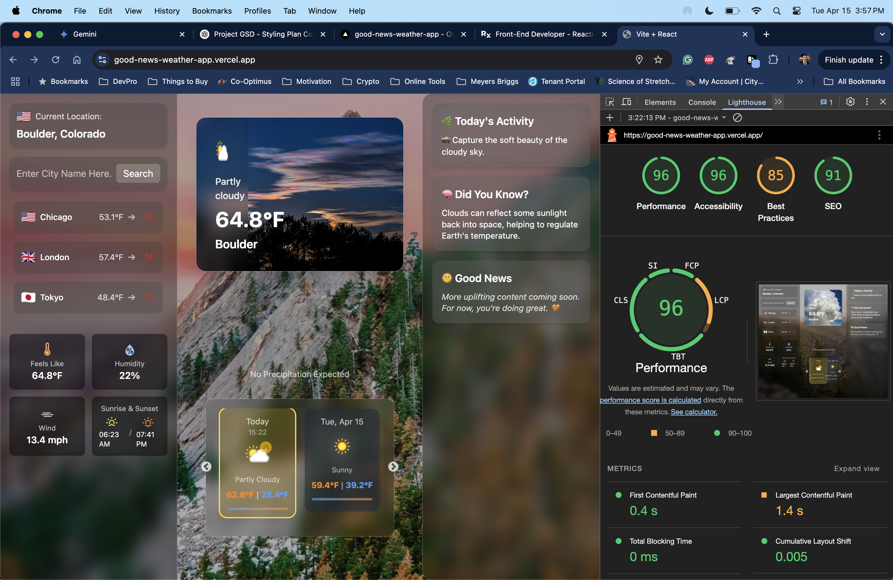

# Good News Weather ☀️🌦

A joyful and polished front-end weather application designed to bring both utility and positivity into your day. This app not only shows localized forecasts using real-time weather data — it also shares uplifting trivia and activity ideas tailored to current conditions, aiming for a cheerful and informative user experience.

## 🚀 Live Site

🔗 [https://good-news-weather-app.vercel.app](https://good-news-weather-app.vercel.app)

## 🌟 Key Features

- 🌐 Local and searched city forecasts (WeatherAPI)
- 📍 Current Location detection (browser geolocation API)
- 🔁 Smooth routing with `react-router-dom`
- 🎨 Glassmorphism design with Tailwind CSS
- ⏳ Loading bar and spinners for great UX
- 🌇 Unsplash image backgrounds that change with weather and location
- 🎭 RightSidebar with:
  - “Today’s Activity” generator
  - Weather fact of the day
  - Placeholder for Good News (V2 feature)
- 🌤️ 7-day Forecast Carousel using `react-slick`
- 🧠 “Today” label adjusts based on each city’s local timezone, addressing potential confusion for global users.
- 🎯 CityTile system with active tracking and removal, allowing users to quickly access their favorite or recently viewed locations.

## 💻 Tech Stack

- React (Vite)
- Tailwind CSS
- React Router
- Framer Motion
- WeatherAPI
- Unsplash API
- React Slick
- React Icons
- React Spinners
- axios
- GitHub + Vercel (CI/CD)

## 📸 Performance

This app was built with a focus on visual delight and accessibility, achieving a high Lighthouse score (example shown below):


- ⚡ **First Contentful Paint**: 0.4s (how quickly the user sees the first content)
- ⚡ **Largest Contentful Paint**: 1.4s (when the main content is loaded)
- 💡 **Total Blocking Time**: 0ms (how responsive the app is during load)
- 💨 **Cumulative Layout Shift**: 0.005 (visual stability of the page)
- ✅ Accessibility, SEO, and Best Practices tested with Lighthouse
- 🔍 Additional analysis done with WebPageTest + React DevTools Profiler

## 🧠 Lessons Learned

- Importance of handling timezone-based data (especially globally)
- React Context structuring for city weather + user preferences
- Tailwind best practices for glassmorphism without performance bloat
- Theming logic separation (weather image vs background)
- Git branching and rebase strategies for clean deploy history
- Challenges and solutions in integrating dynamic backgrounds from Unsplash based on location and weather.

## 🗂 Folder Structure

├── public/
│ └── fallbackBg.jpg
├── src/
│ ├── components/ # Reusable UI components
│ ├── context/ # Global state via Context API
│ ├── hooks/ # Custom React hooks
│ ├── pages/ # Route-based views (e.g. HomePage, CityPage)
│ ├── utils/ # API fetch logic, helpers
│ ├── App.jsx # Main layout wrapper
│ ├── main.jsx # Vite entry point
│ └── main.css # Tailwind base styles
├── index.html # Root HTML template
├── package.json
├── package-lock.json
├── tailwind.config.js # Tailwind theme customization
├── vite.config.js # Vite-specific build settings
└── README.md

## 📦 Installation & Setup

```bash
git clone [https://github.com/Ricecake-Pony/good-news-weather-app.git](https://github.com/Ricecake-Pony/good-news-weather-app.git)
cd good-news-weather-app
npm install
npm run dev
```
